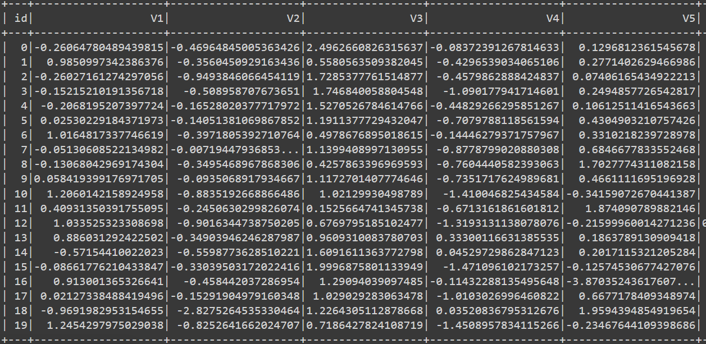
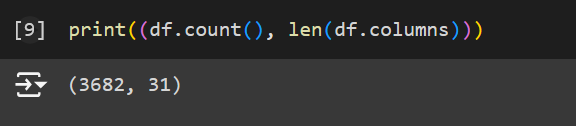
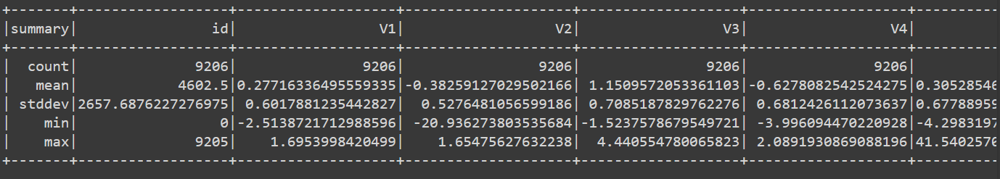
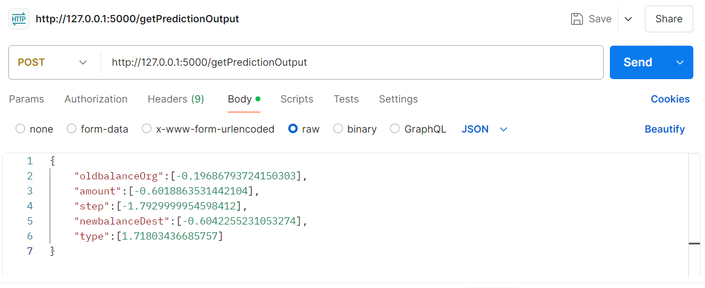
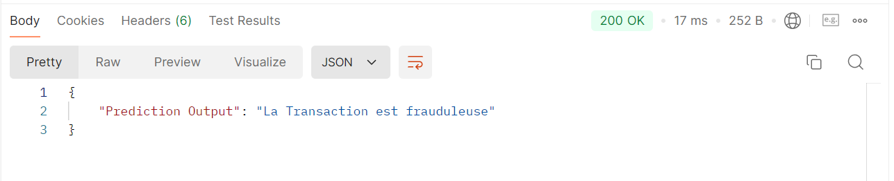

# Fraud Detection System

## Table of Contents
* [General Info](#general-information)
* [Technologies Used](#technologies-used)
* [Screenshots](#screenshots)
<!-- * [License](#license) -->

## General Information
The fraud detection system is designed to identify fraudulent transactions using machine learning models. The system employs multiple classification algorithms, including Logistic Regression, Decision Tree, and Random Forest, to detect potential fraud. The transaction data is cleaned and prepared to suit the needs of these models. A RESTful API is created using Flask to allow users to submit transactions and receive predictions on their fraudulent nature. The API handles requests and returns predictions, making it easy to integrate with other systems.

## Technologies Used
- Python
- Flask
- Pandas
- Scikit-learn
- Flask-RESTful

## Screenshots

Raw Data (Taken form kaggle : "https://www.kaggle.com/datasets/ealaxi/paysim1" )

Shape of the Data

Description of Data

Test of API : The request 

Test of API : The response 
<!-- If you have screenshots you'd like to share, include them here. -->

<!-- Optional -->
<!-- ## License -->
<!-- This project is open source and available under the [... License](). -->

<!-- You don't have to include all sections - just the one's relevant to your project -->
